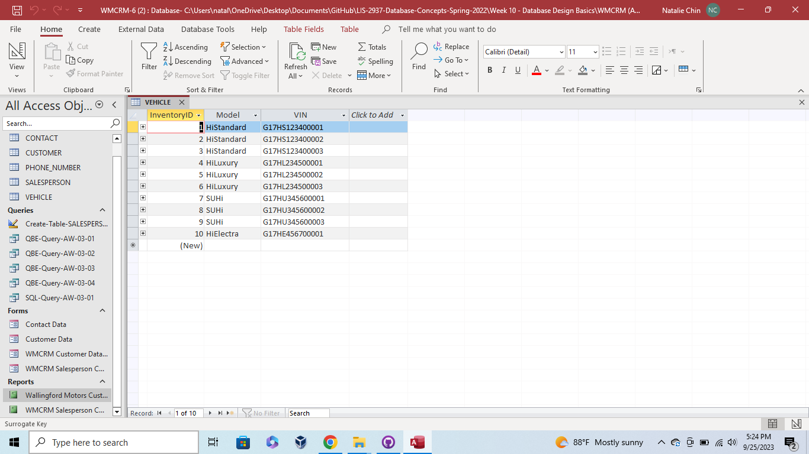

# Week 10 - Database Design Basics

This week, a Vehicle table was created to display data relating to Inventory. This included the vehicle model type and VIN number, which relates back to the customer. This completes the entire Database as it ties together the customer, contact information, phone number, salesperson, and vehicle information. This was created while incorporating database design and SQL coding.

* Addition of Vehicle Table

