# Week 11 - Data Relationships

This week, a Student, Courses, and Schedule table was created and data was inputted. Queries were created using SQL code to put together data and calculate different information, including average GPA by major, business major with students who are not a U.S. citizen, Total Credits Earned by GPA, and Total Credits Earned by Major.

Images of the tables and queries are displayed below.

* Student Table
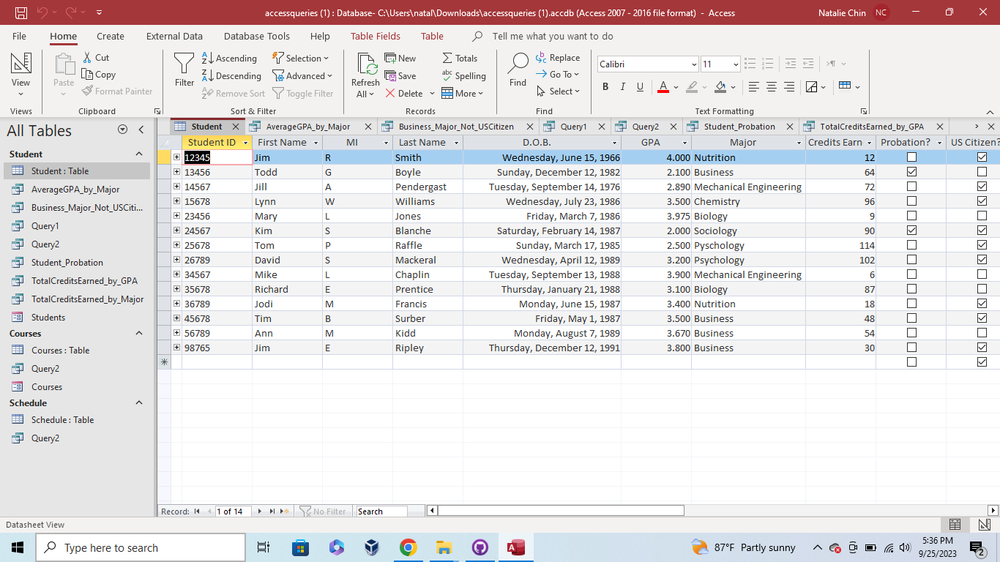
* AverageGPA_by_Major Query
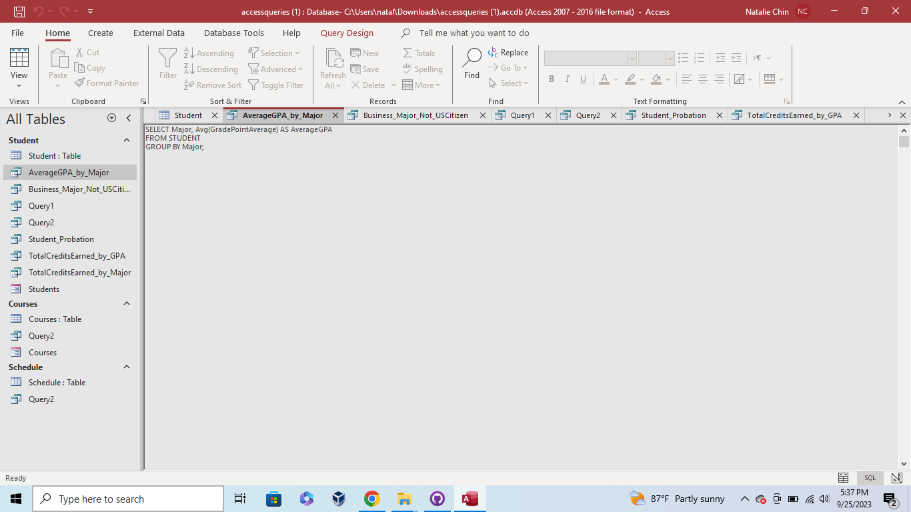
* Business_Major_Not_USCitizen Query
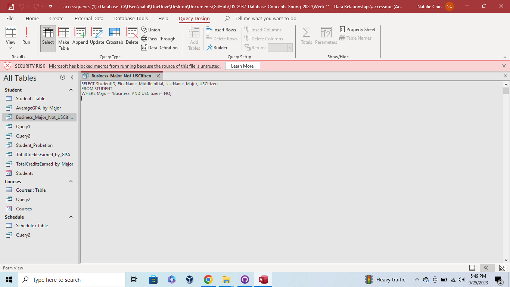
* Query 1
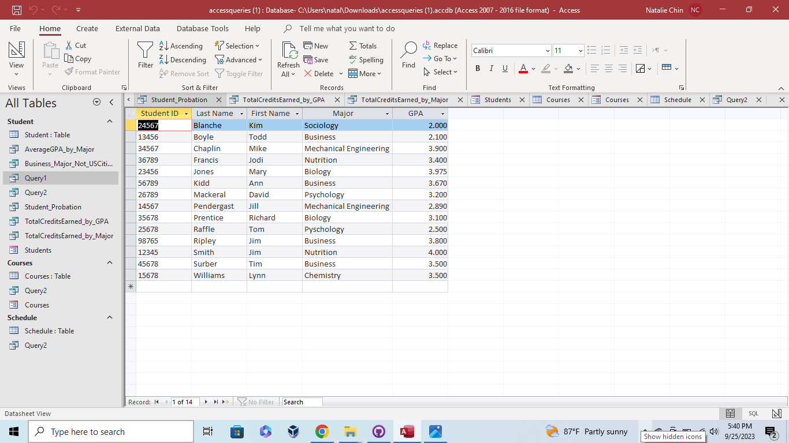
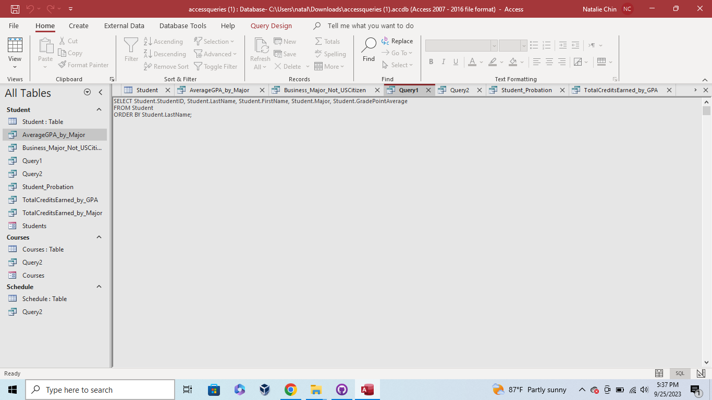
* Query 2
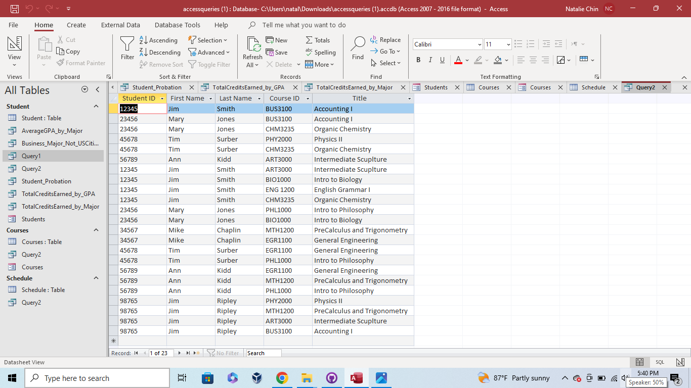
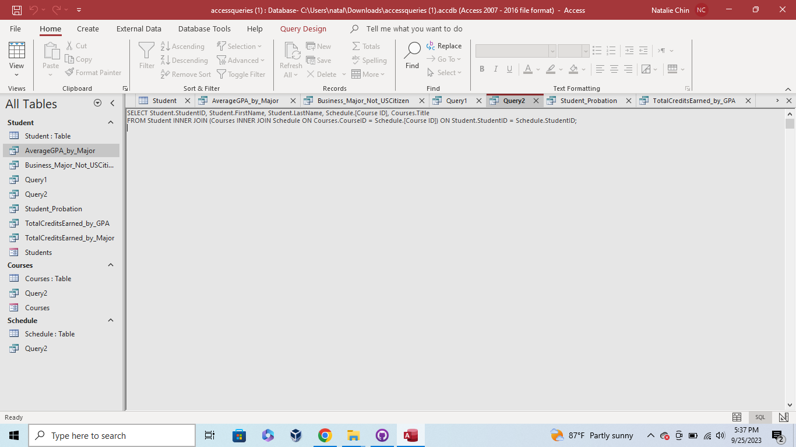
* Student Probation Query
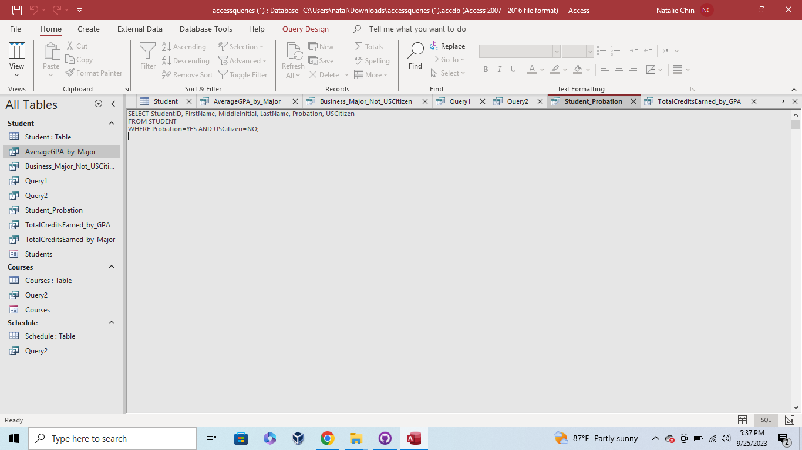
* TotalCreditsEarned_by_GPA
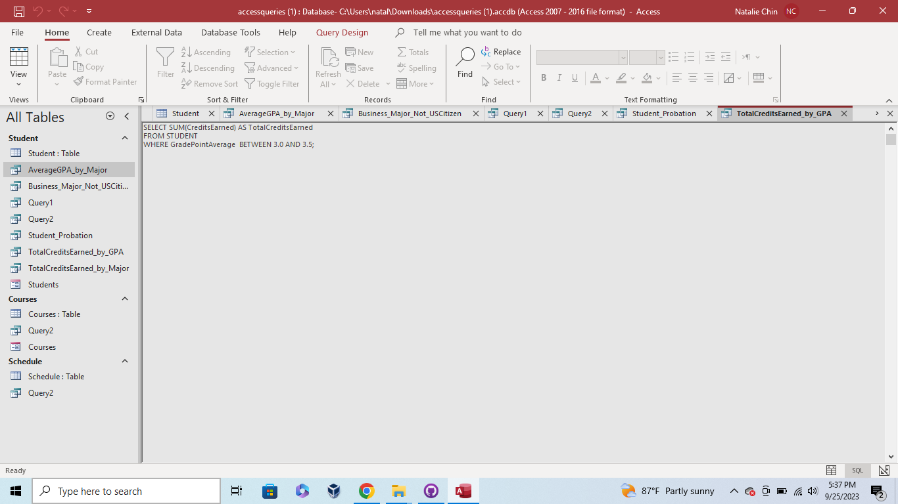
* TotalCreditsEarned_by_Major
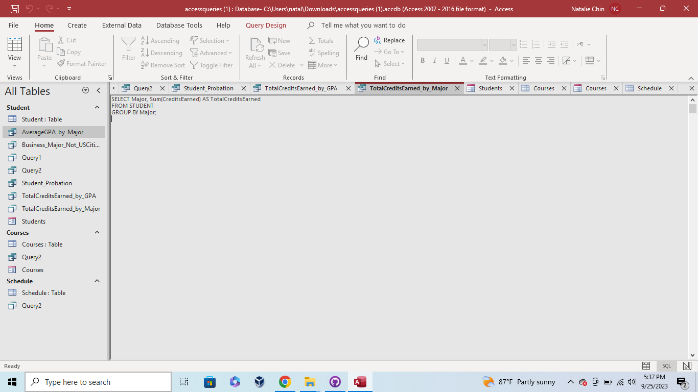
* Students Form
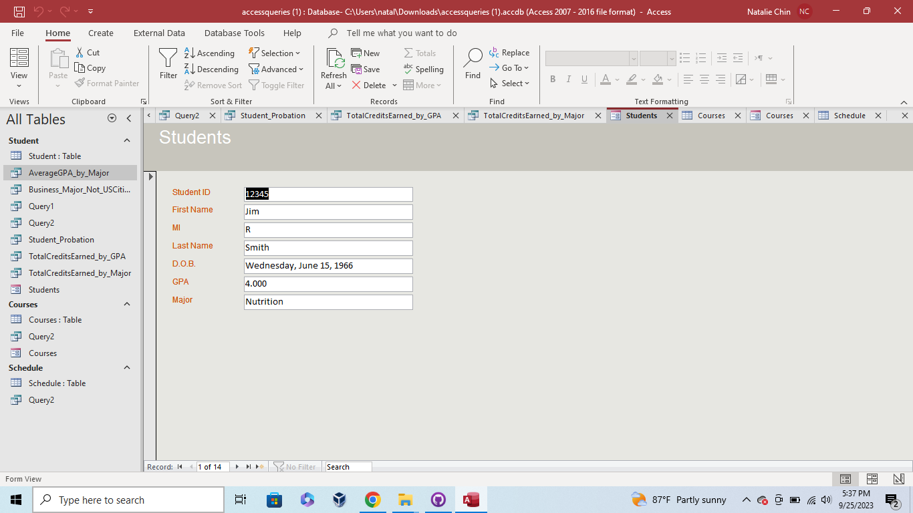
* Courses Table
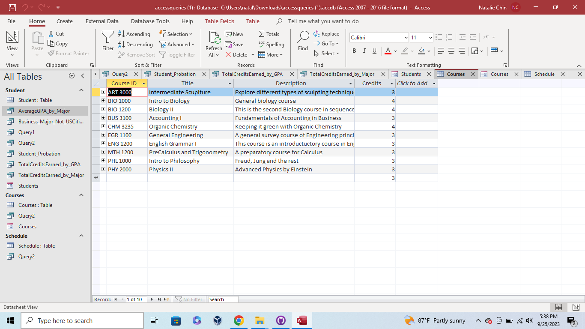
* Schedule Table
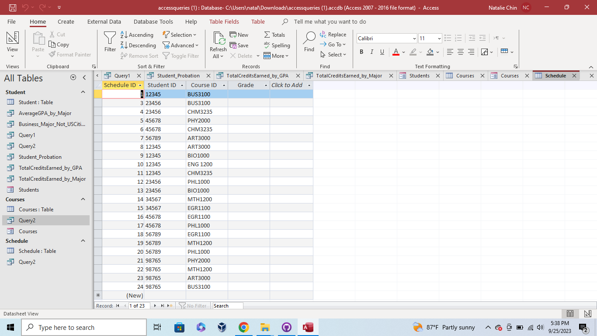

 