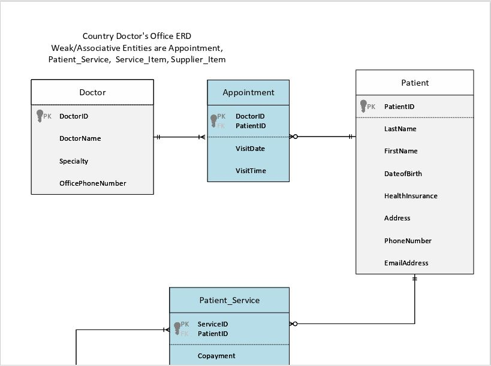
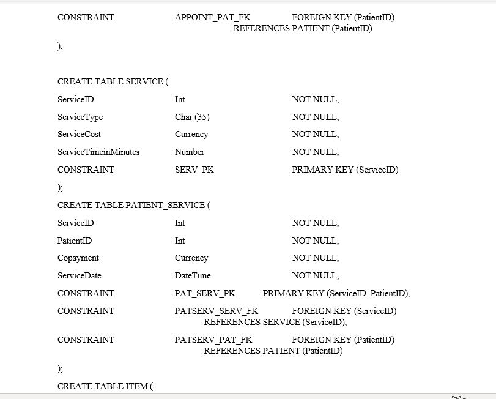
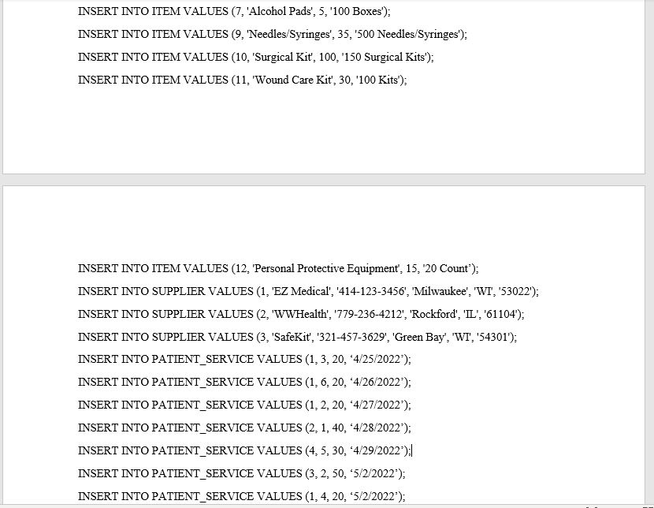
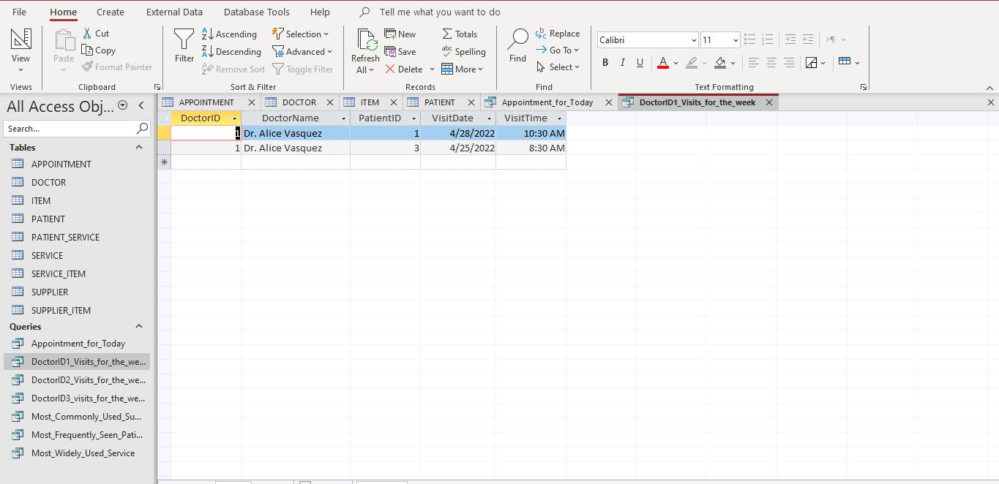
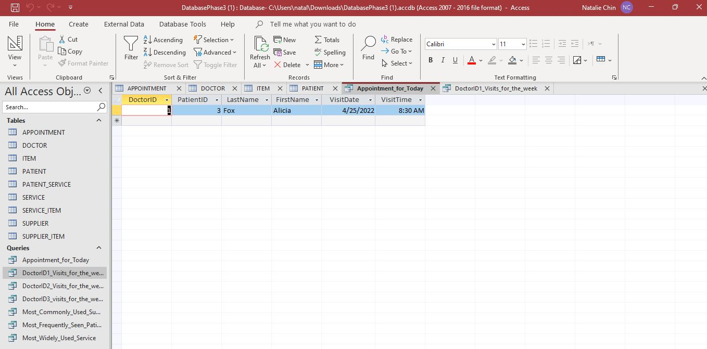
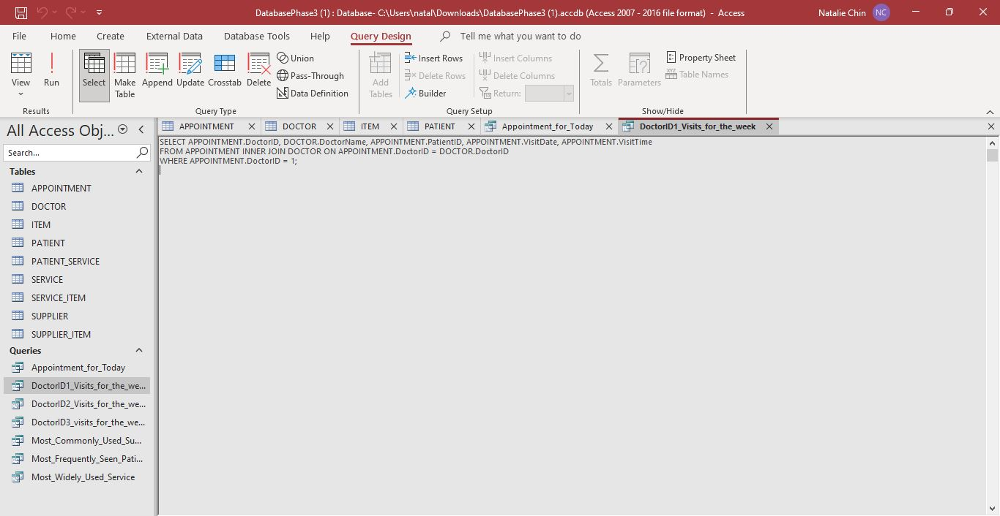

# Week 12 - Database Project

For this project, I developed a database system for a country doctor's office. The office has three doctors that serve approximately 100 patients. Three phases were developed, which included an entity relationship diagram, converting the diagram into tables with the associated fields using SQL, and building the database in Microsoft Access. Each phase builds upon the next and leads to a comprehensive database with the following tables:  doctors, patients, services, supplies used, suppliers, and appointments.

* Phase 1: Entity Relationship Diagram
This phase, an entity relationship diagram was created to demonstrate the relationship between the doctors, patients, services, supplies used, suppliers, and appointments. It is supposed to demonstrate the system and entities that make up a doctor's office.

* Phase 2: Populating Tables
For this phase, SQL language was used to create the tables and populate the content for those tables. The purpose is to communicate the layout that will be used for the database.

*Phase 3: Creating the Database in Microsoft Access
For this phase, the database is created based on the entity relationship diagram and the created tables. From this database, the following queries were generated: a list of patients who have appointments for today, which patients most frequently come to the office, which service that is most widely used, which suppliers provide the most commonly used supplies, and a schedule of appointments for each doctor for the week.

