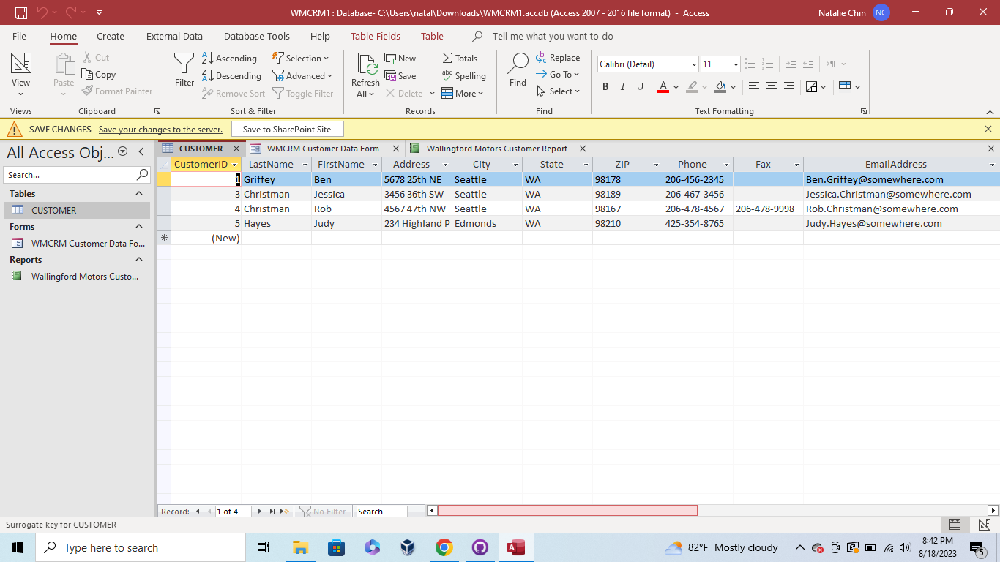
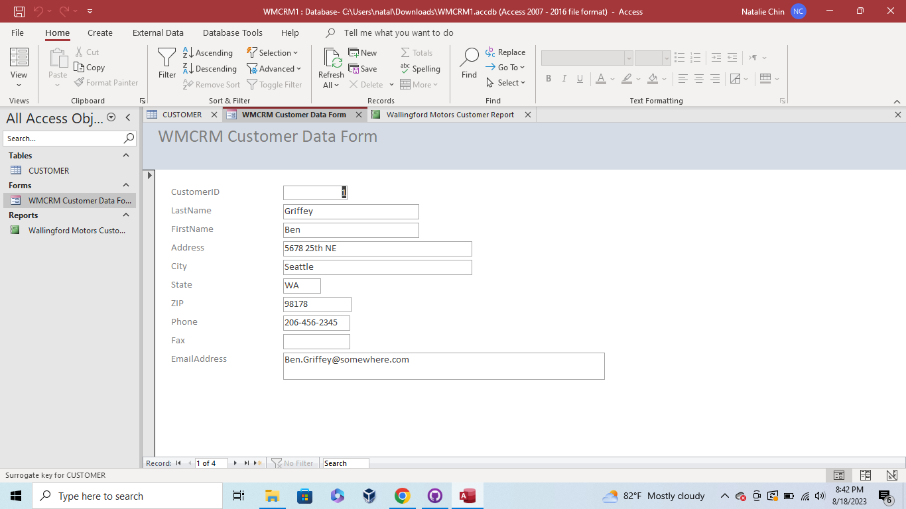
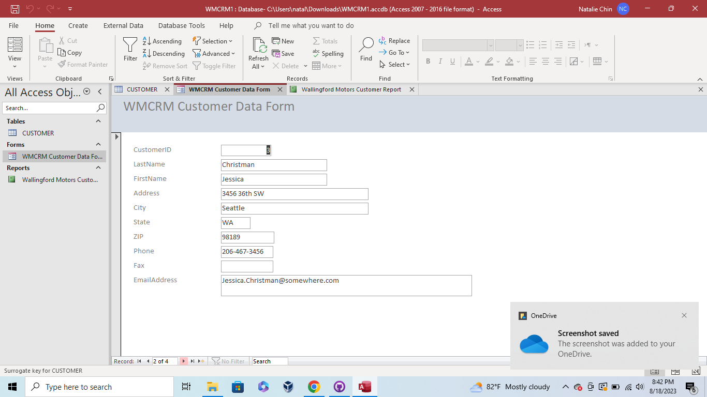
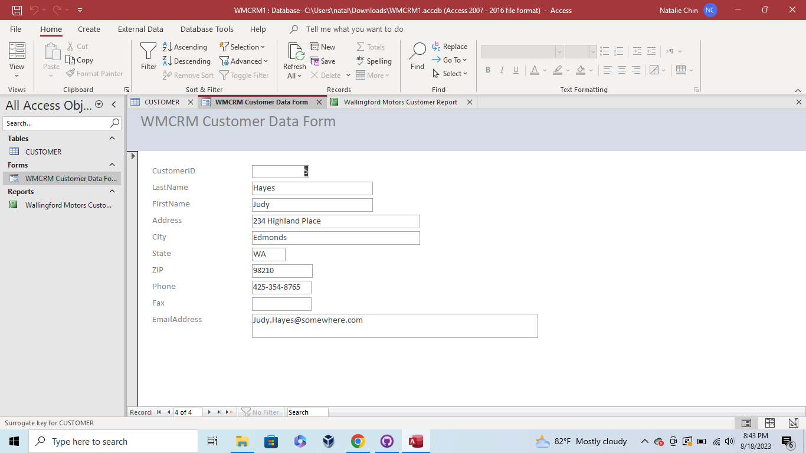
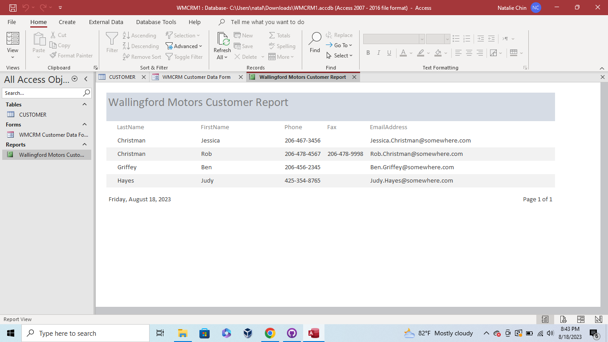

Week 2 - Getting Started With Microsoft Access

This week began with learning how to arrange customer information in a table, a Customer Data Form, and a Customer Report while using Microsoft Access. This required a tutorial on all the tools that Microsoft Access offers, as well as database concepts and terminology. Datasheet and Design view when creating tables were also taught and reviewed. If you notice, customer 2 is missing from the database. This will be addressed in a future assignment.

* Customer Table

* WMCRM Customer Data Form

* Wallingford Motors Customer Report
