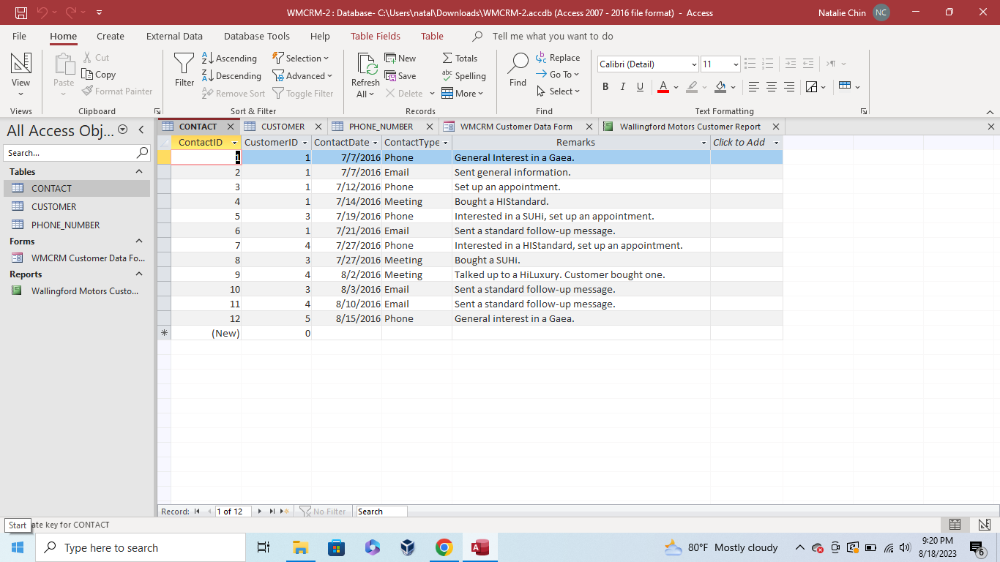
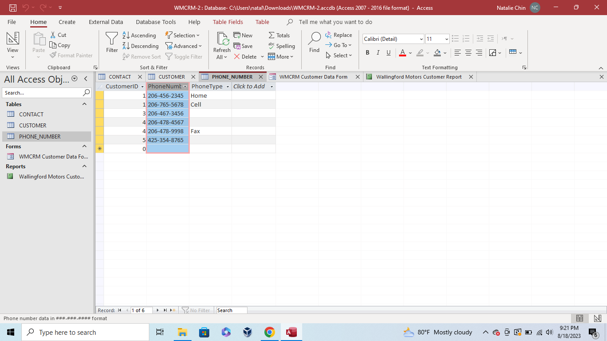
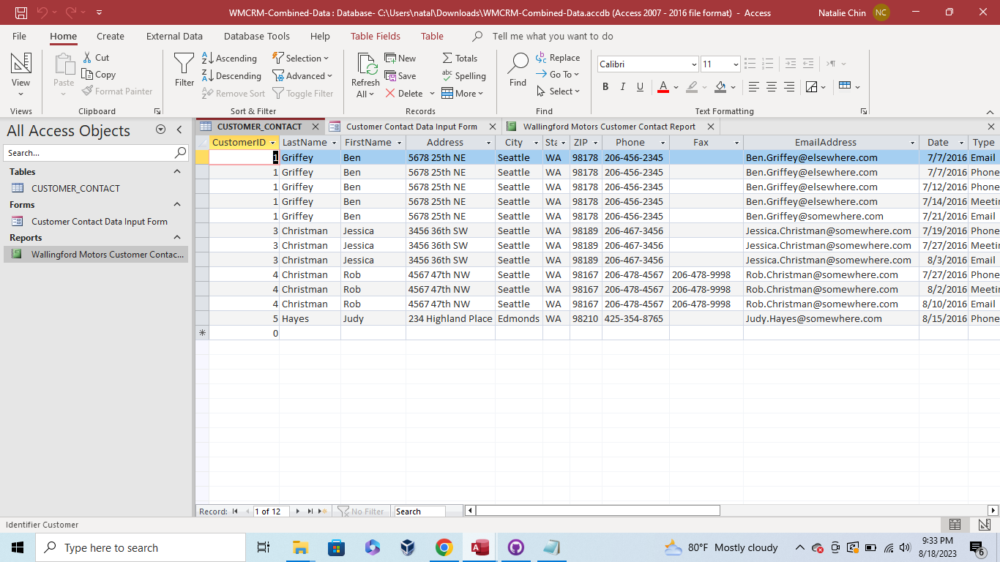
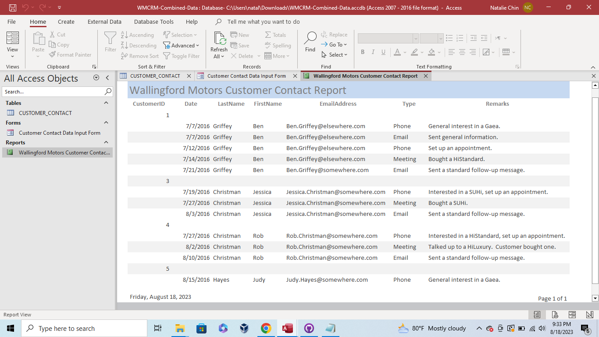
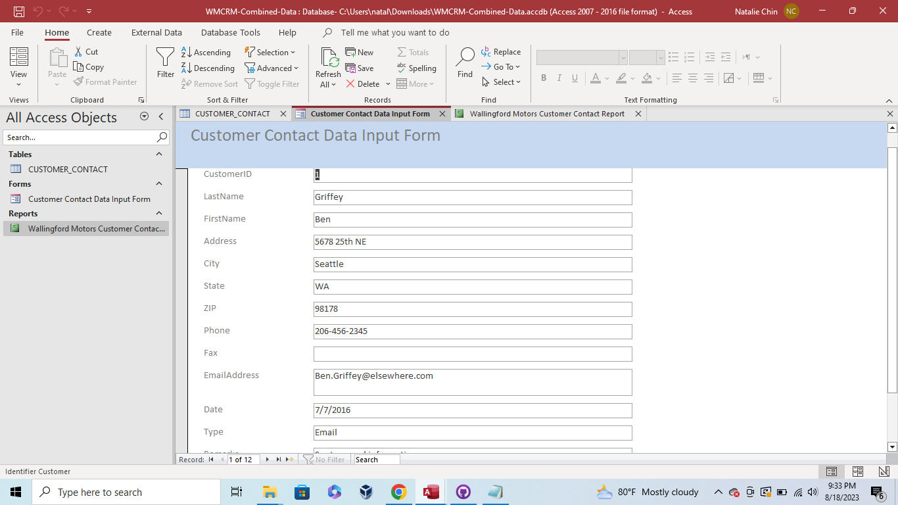

Week 3 - The Relational Model
This week's assignment added the Contact table and Phone Number table to the Microsoft Access Database.
* Contact Table

* Phone Number Table

This week also included an assignment where the tables were combined into one database in Microsoft Access. This included all the customer information into one table.
* Combined Database

* Combined Contact Report

* Customer Data Input
