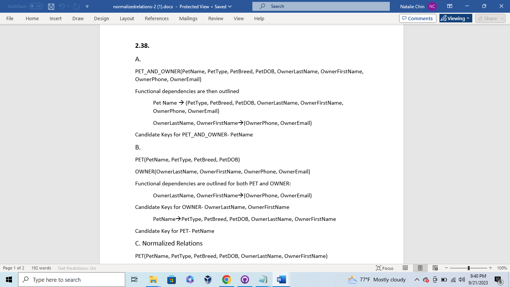
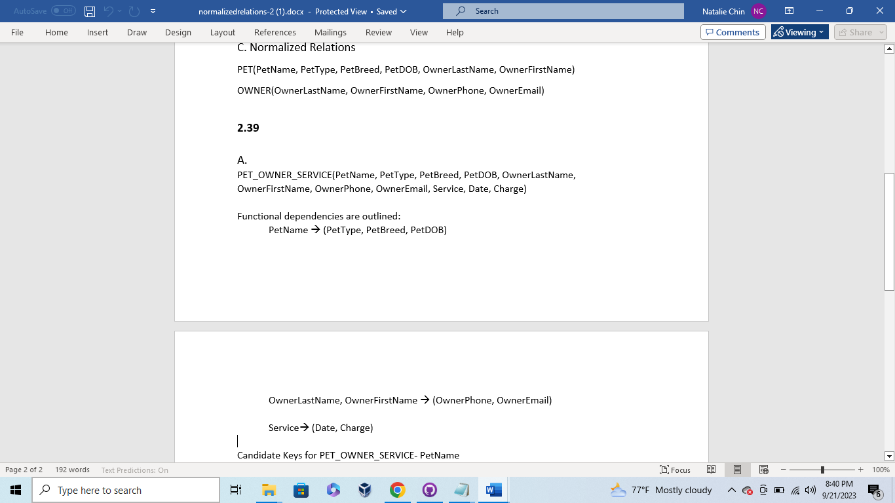
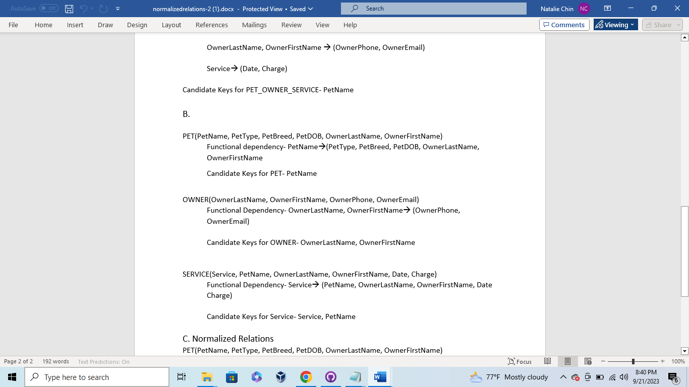
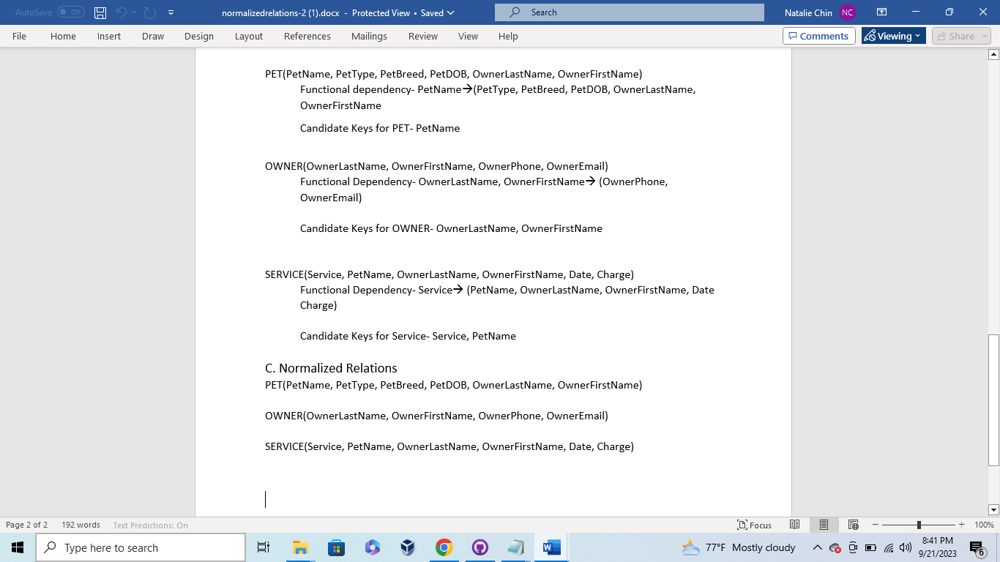

# Week 4 - Normalization

This assignment focused on breaking down how to normalize tables in databases. This requires normalization of a relational database.
* Relational Database Normalization

