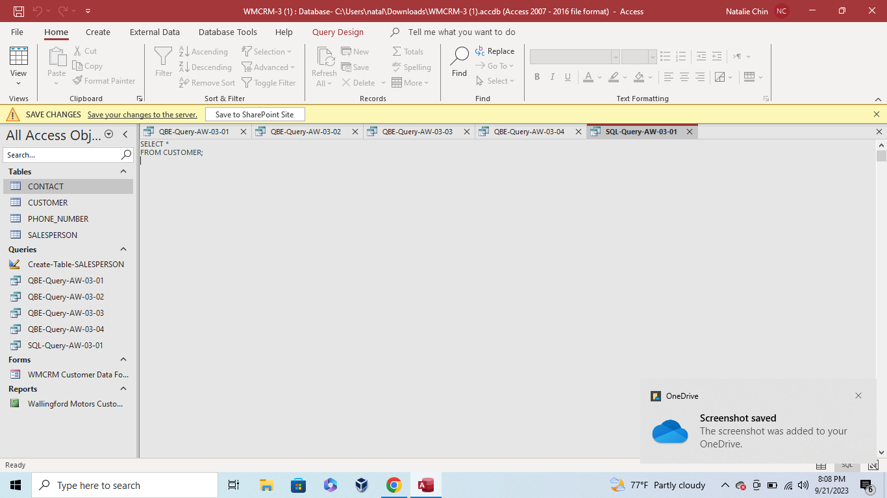

# Week 5 - Structured Query Language (SQL) Basics

This week's project required forming SQL queries that formatted the contents of the tables. This required using coding with SQL language to format the contents of the tables. The following images show the SQL Queries.
* SQL Query 1

* SQL Query 2

* SQL Query 3

* SQL Query 4

* SQL Query 5

