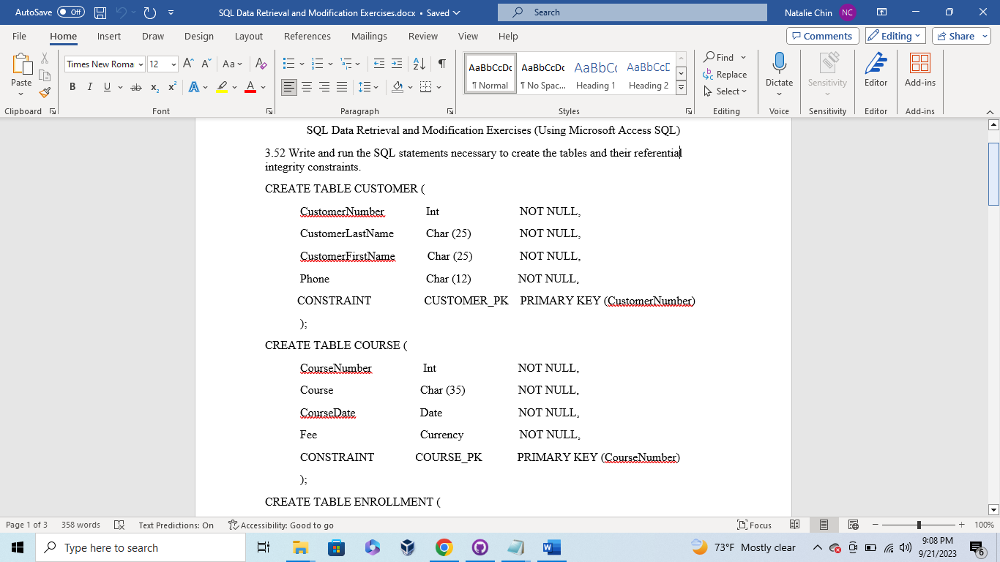
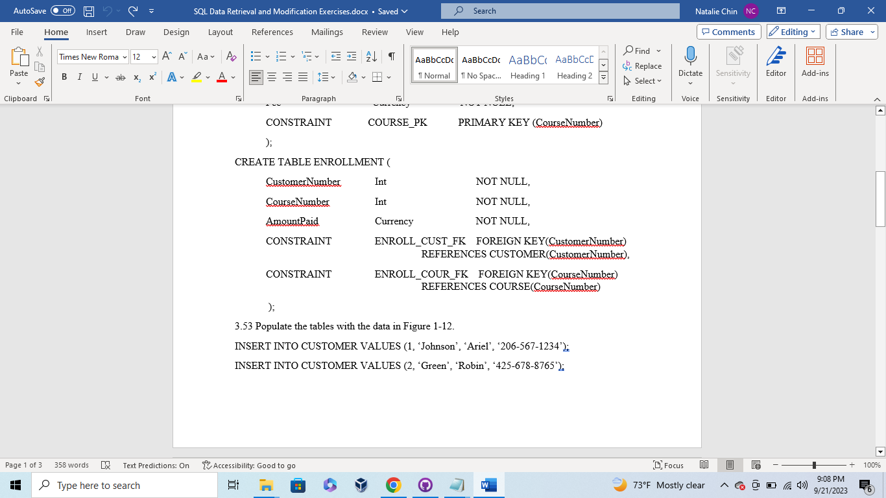
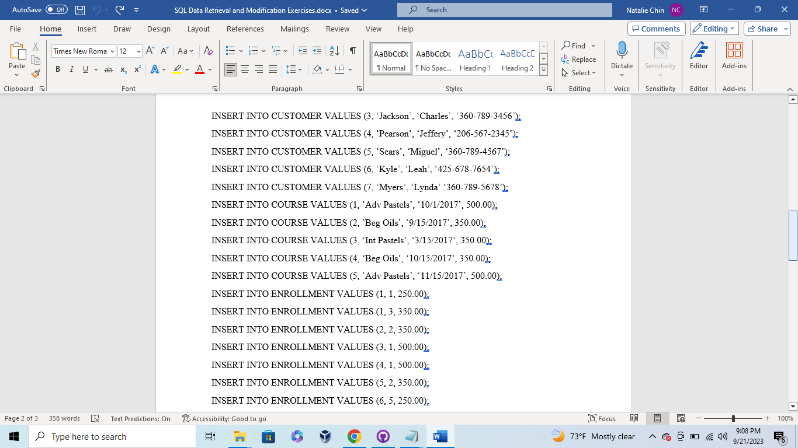
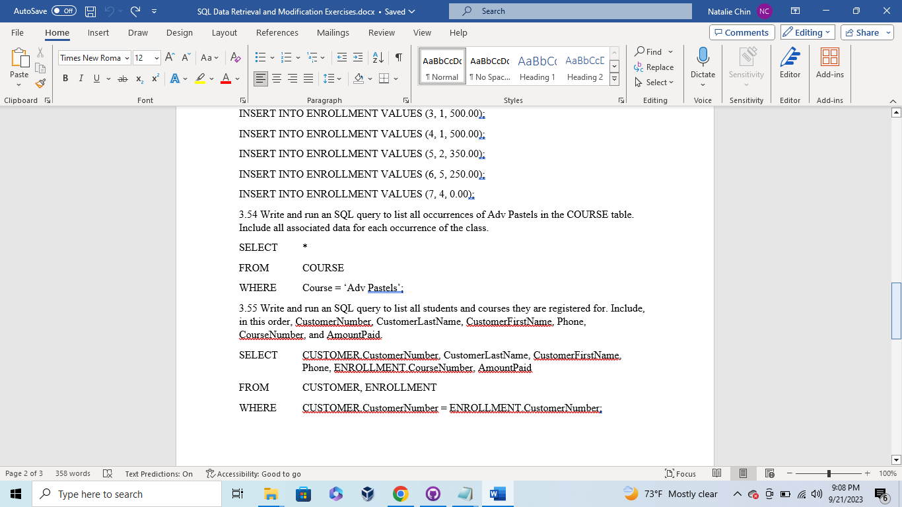

Week 6 - Structured Query Language (SQL) Data Retrieval and Modification Exercises

This assignment required using SQL to create tables and populate those tables with data and content.
* SQL Data Retrieval and Modification Exercises

