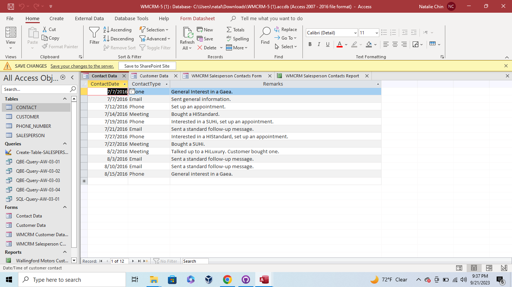
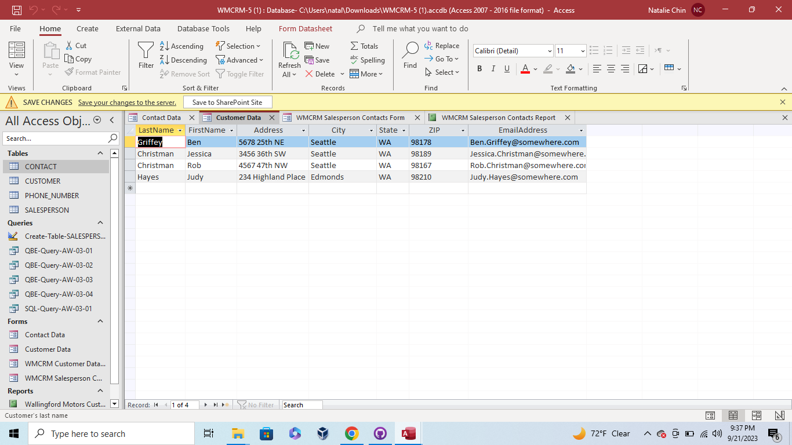
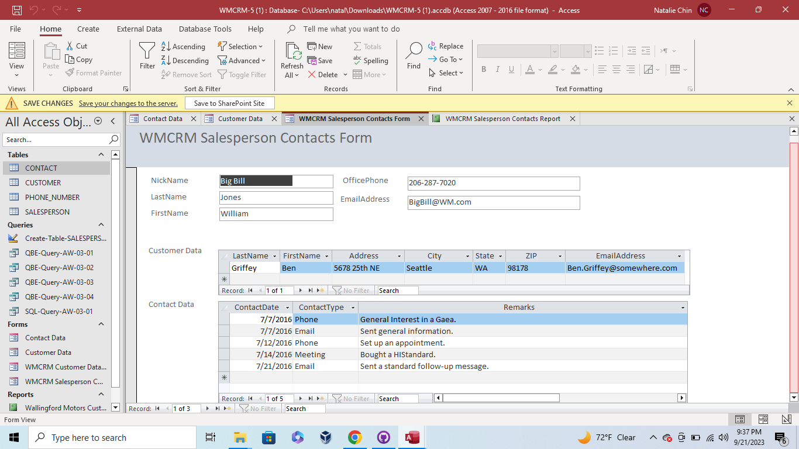
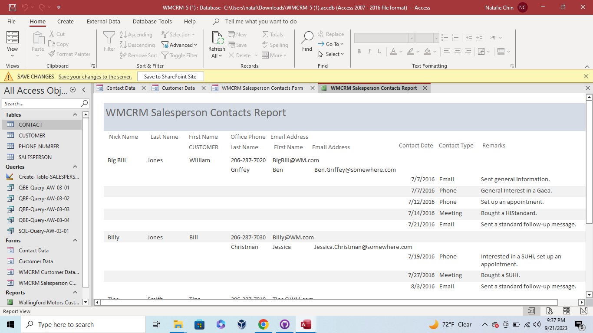
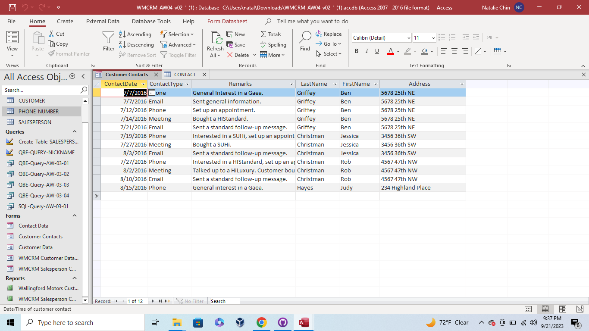
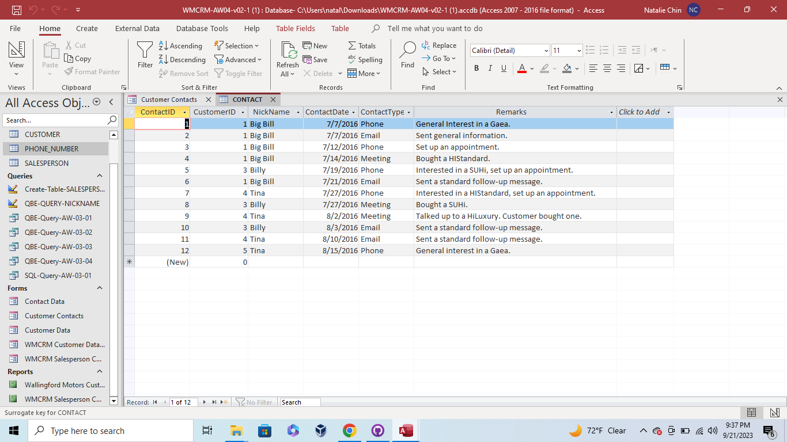

Week 7 - Data Modeling

This assignment populates the database tables with further data in Microsoft Access and merges the data to other tables. This included adding a Contact Data table, Customer Data table, Salesperson Contacts Form, and a Salesperson Contacts Report. It also showed merging the data from the contact and customer data tables into one database named the Customer Contacts Form. The column Nickname was also added to the Contact table.

* Contact Data Table

* Customer Data Table

* Salesperson Contacts Form

* Salesperson Contacts Report

This database shows the Customer Contacts Form and the addition of the Salesperson's nickname to the Contact table.
* Customer Contacts Form

* Addition of Nickname column to Contact Table

