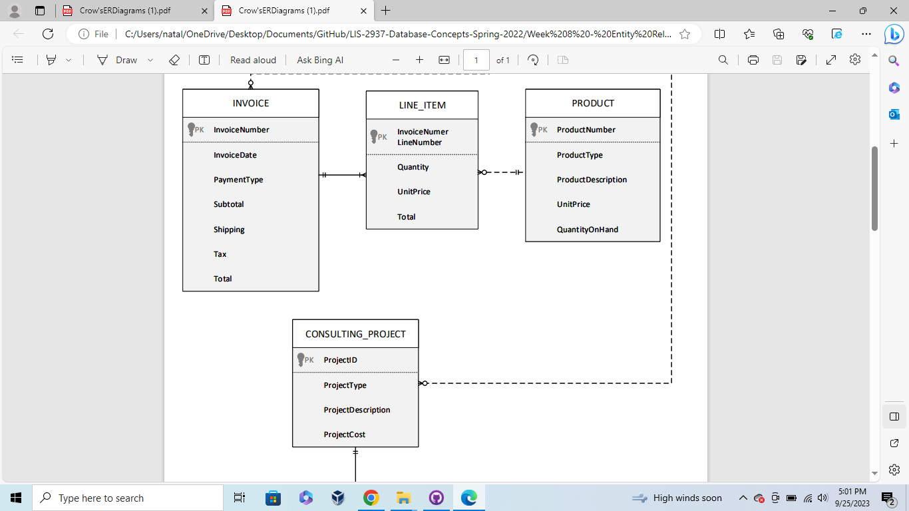
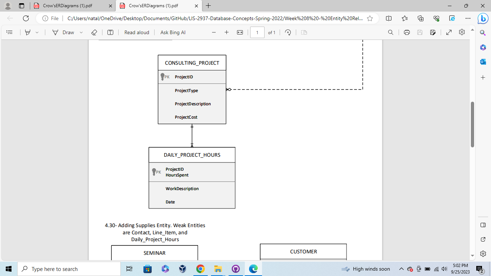
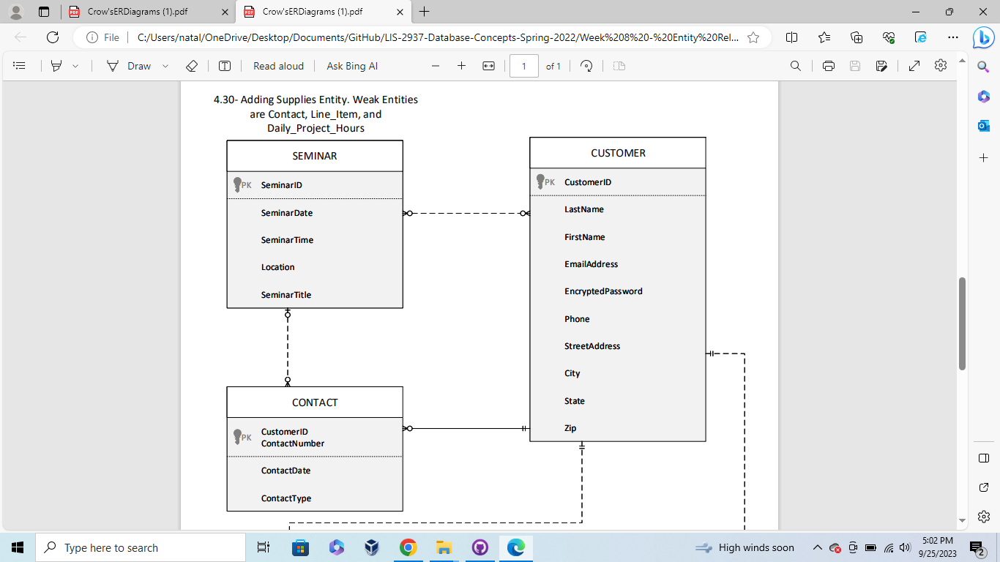
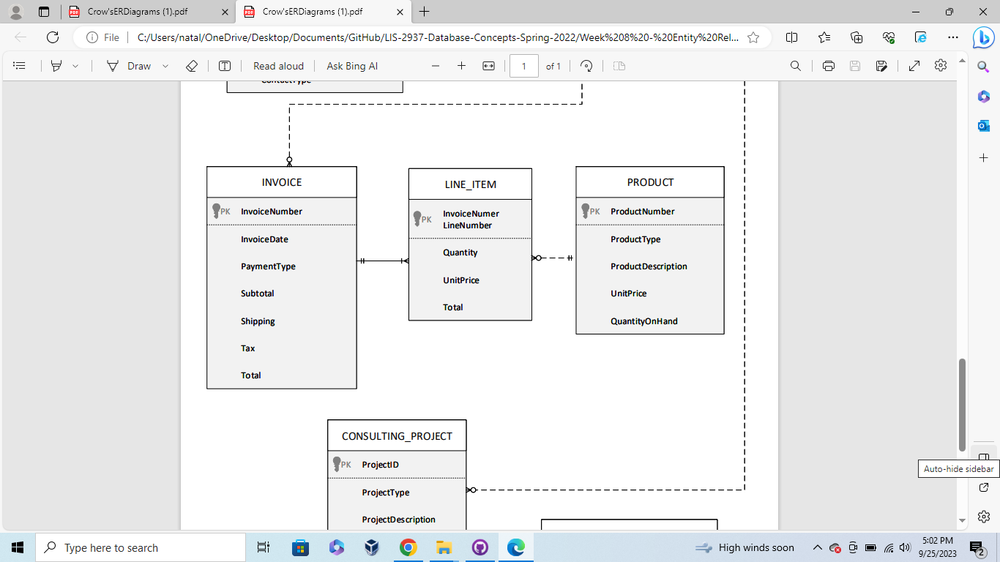
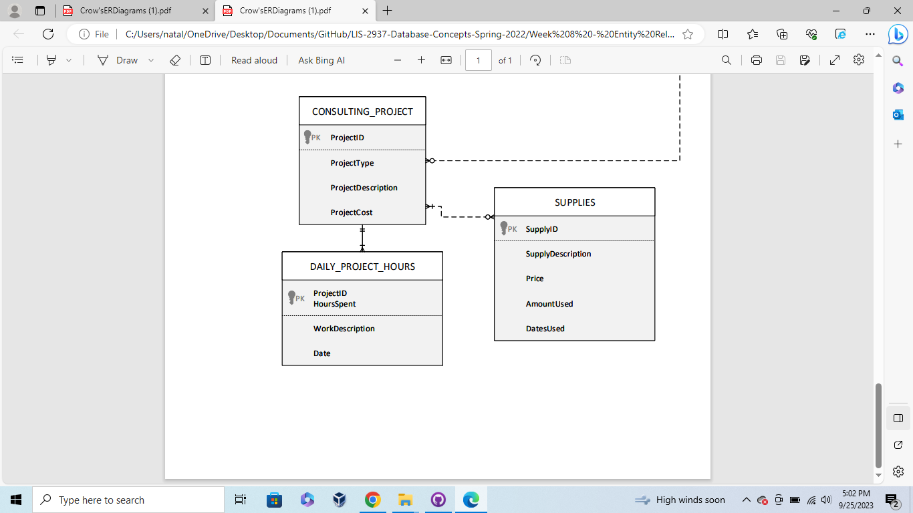

# Week 8 - Entity Relationship Diagrams

This week, I worked on creating entities for entity relationship diagrams. First, I added a Project entity and Project Hours entity with the appropriate attributes. Then, I added a Supplies entity with the appropriate attributes. The relationships between the entities are demonstrated by crow's feet notation.

The relationship between Customer to Project shows a relationship of one and only one customer to zero or many projects. The relationship between Project and Project Hours are one and only one project to one or many project hours.
The relationship between Project and Supplies are one or many projects to zero or many supplies.
Images are displayed below.

* Entity Relationship Diagram

